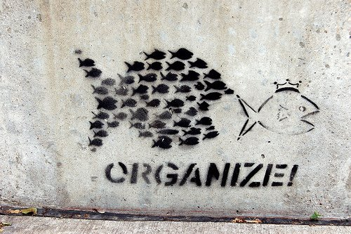
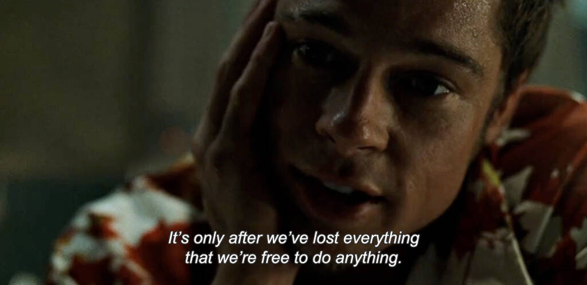
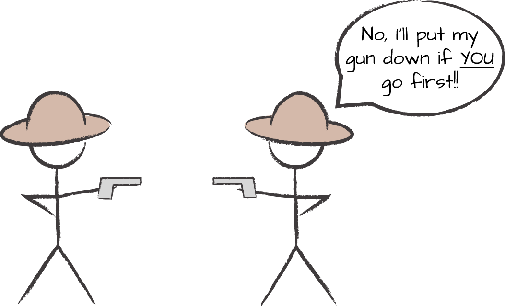
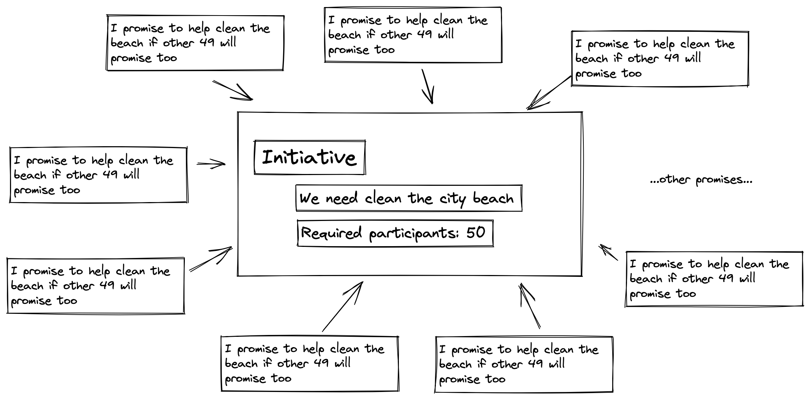
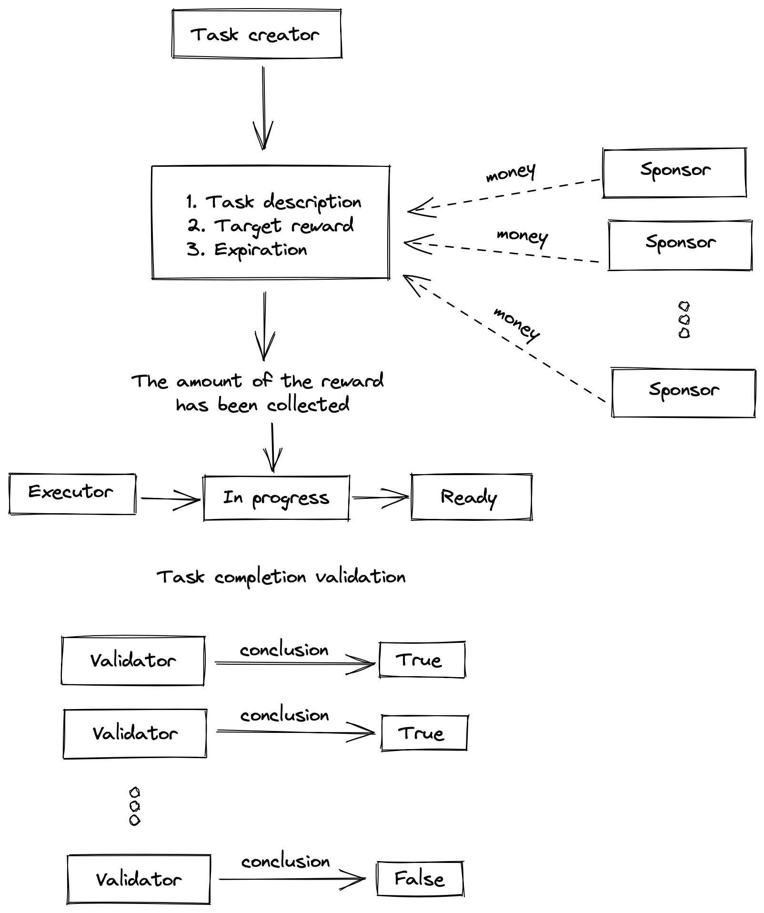
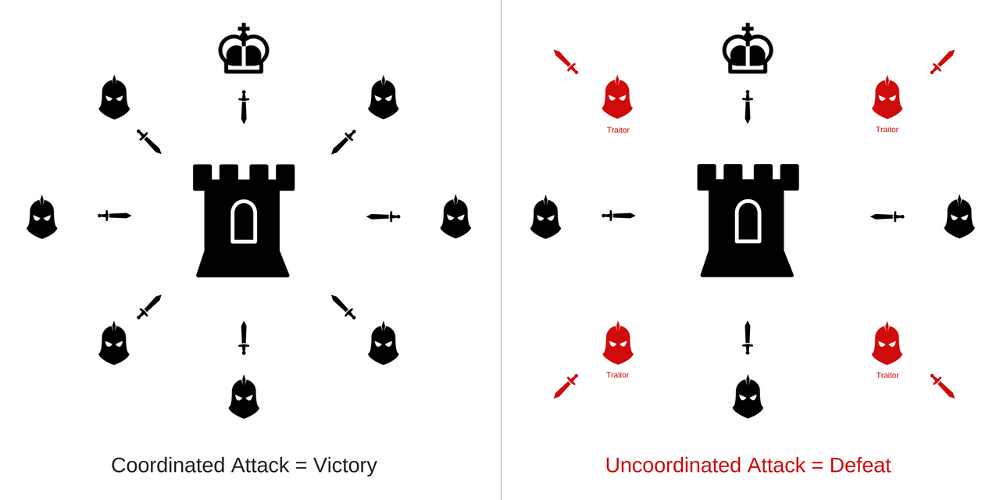

When someone talk about global problems and how to solve them, I often hear - "if we all", "if everyone", "if each of us...", if...

But I have never heard how it is proposed to implement this "if". How is it proposed to make it so that "we are all" and that "everyone".

My life experience says that "we all" and "everyone" work well without any innovations in small groups — our family, friends, acquaintances. In general, if there is a desire, we can agree to do something together. Because we know each other and we have high level of trust, we are not nobody to each other.

## Problem comes here

**Man is weak alone.** It is obviously. For a real solution to global problems, the effort of the one family or one group of people **is not enough**. We need hundreds and thousands of people.

But **coordinating is difficult.** Especially the cordination of large group of people unfamiliar with each other. For many reasons.

Eliezer Yudkowsky says:

> VISITOR: Even in my world, Simplicio, coordination isn’t as simple as everyone jumping simultaneously every time one person shouts “Jump!” For coordinated action to be successful, you need to trust the institution that says what the action should be, and a majority of people have to trust that institution, and they have to know that other people trust the institution, so that everyone expects the coordinated action to occur at the critical time, so that it makes sense for them to act too.
>
> That’s why we have policy prediction markets and… there doesn’t seem to be a word in your language for the timed-collective-action-threshold-conditional-commitment… hold on, this cultural translator isn’t making any sense. “Kickstarter”? You have the key concept, but you use it mainly for making video games?

## We need to start somewhere.

So let's just take the mentioned coordination requirements (look real, yeah?) and try to think about how to implement this from scratch (is in possiblt at all?)

1. Need to have institution that says what the action should be
2. Majority of people trust that institution
3. They know that other people trust the institution
4. Everyone expects the coordinated action to occur at the critical time

Finding institutions that want you to do something (like fund them, haha) is easy. There is no problem here. ✅

Let's check next. "Majority of people". Majority of people where? In the countrly? In the city? In the some community?
Let's try the country. Assume that we live in a country with 100M population. Majority of people in this case is 50M+ of people.
Okaaaay, Google. How to create institution known (mind you, not even talking about trust) by 50M+ of people? ❌

P.S. Actually answer is known. See [here](https://en.wikipedia.org/wiki/List_of_most-followed_Twitter_accounts) and [here](https://en.wikipedia.org/wiki/List_of_most-subscribed_YouTube_channels) 😄

## Groups with target number of participants.

We can't build institution known by majority of people of whole country. At least we can't build it alone (cooperation problem even here!) and in short time.
We need to think towards to more realistic conditions.

Each coordination has particular purpose. We come together to achieve something. I think in most cases we no need to majority of people to achieve our goal. Just need particular number of cooperation participant.

I can imagine world where someone can create "initiative" — define goal, description, target number participants and publish it somewhere.
And it already really works — people create "events" on social networks and gather other people.

What happens? It turns out there is no problem actually? 🤔

Not so fast. If you consider that "events" closer you will see that mostly this "events" is "safe".
"Safe" is when participating in event have near zero risk (life, health, finance, legal).

What about unsafe and dangerous events?
In most cases, attempts to solve really important problems cause conflict with the authorities, corporations, police or criminals.
We need to continue our attempts and find solution for unsafe initiatives / events / actions. ❌

## How to deal with unsafe actions?

The preambule of [Universal declaration of human rights](https://en.wikisource.org/wiki/Universal_Declaration_of_Human_Rights) says:

> Whereas it is essential, if man is not to be compelled to have recourse, as a **last resort**, to rebellion against tyranny and oppression, that human rights should be protected by the rule of law...

Okay. But what is relation between unsafe actions and this quote from UDHR? Answer is highlighed "last resort".

**The rebels have nothing to lose. The rioters are no longer afraid of anything.**

Unsafe actions is not a problem for a desperate people. For angry and tired people. For people that lost everything.

It is reason why we do not consider how to deal with unsafe actions when you nothing to lose and when you are not afraid. We considering more typical situation when you have something that you don't want to loose — family, health, money, reputation, etc.

We still can take some risk, but is much more complicated to evaluate whether it is worth the risk.
My life experience says that for involve really big number of people in something risky we need to reduce risk to near-zero level.
Inpossible? Yeah, looks like. But this is reality.

Let's try to guess how we can do this.

### Conditional participation

Conditional participation is when you promise to do something when some condition will met. For example: _I promise to help clean the beach if other 49 will promise too_. The idea looks good. Here we use [Diffusion of responsibility](https://en.wikipedia.org/wiki/Diffusion_of_responsibility) and [Bandwagon effect](https://en.wikipedia.org/wiki/Bandwagon_effect) to reduce the likelihood of punishing the participant.

Unfortunately, practice shows that it is extremely easy for people to decide not to participate in anything. I think because there is no penalty or damages for refusing to participate. Also because people don't trust to the system.

### Delegated action. Conditional funding

In this case we pay money for task executor if and only if task will be completed.

Delegated action scenario can be like this.

1. Someone create the task, where describe task, define reward
2. Unlimited "sponsors" can fund this task
3. When task's reward amount reached, task can be taken in work by some "executor".
4. If executor mark task as ready in the game coming "validators".
5. Validators must confirm that task is really completed and completed sufficiently or not.
6. If confirmation is received, the executor can collect the reward.

Ok, let me draw it:

This flow very simplified, but descibed key concept.
Problem is how to do validation right way and make it reliable. How to protect sponsors and the executor from fraud?
Currently I don't know how to make it possible.

## Byzantine generals problem (BGP)

Both methods that I described above have a common problem — people can lie, people can do something that doesn't correspond to what they said, declaration of intent may not correspond to actual actions. In general, **people can producing unwanted results (to lie, intentionally or not; failure to fulfill a promise) which are making a group unable to reach an agreement**

That problem known as "Byzantine generals problem".

> We imagine that several divisions of the Byzantine army are camped outside an enemy city, each division commanded by its own general. The generals can communicate with one another only by messenger. After observing the enemy, they must decide upon a common plan of action. However, some of the generals may be traitors, trying to prevent the loyal generals from reaching agreement.

Generals use courier for communication. Courier can be captured by the enemy, betray, deliver wrong messsage or just lost it. In general, there is no reliable communication channel between the generals.

The problem is how to reach an agreement in such conditions (you can't trust anyone).

If you try to google this you will see that almost in all cases BGP solutions considering in blockchain context. In context of computer science.
And all the proposals for a solution are based on the thesis where the general is not a human, but a computer.

Ok. We can force computers to following the some protocol (ordered instructions). What about humans? We can't convert people to computers (as we know them). Even if we imagine that in the future we will implant communication chip into our brains, we are still not protected from "human naturee".

Do you know at least one way to "force" people follow the protocol?

# Human nature

> What? Human nature? I feel unscientific smell!

Of course I mean biological human specification and I'm not talking about the chakras, astral body, aura or something like this.

Douglas Hofstadter says:

> When we humans think, we certainly do change our own mental rules, and we change the rules that change the rules, and on and on-but these are, so to speak, "software rules". However, the rules at bottom do not change. Neurons run in the same simple way the whole time. You can't "think" your neurons into running some nonneural way, although you can make your mind change style or subject of thought. Like Achilles in the Prelude, Ant Fugue, you have access to your thoughts but not to your neurons. Software rules on various levels can change; hardware rules cannot-in fact, to their rigidity is due the software's flexibility! Not a paradox at all, but a fundamental, simple fact about the mechanisms of intelligence.

We should find the way to use our "hardware" for protocol execution. Because our "hardware" works tha same way regardless of our beliefs ("software") — about god exeistance, ideas about what a man or a woman should be like, how to live properly, which programming language is better, which is better ios or android and many other "software" things.

# Summary

- Coordination is diffucult. Much difficult then I can describe in this article.
- To solve "big problem" not always we need the majority of people.
- Solution of "big problem" often required big risk.
- Most people are not ready to take this (big) risk.
- To reduce risk to near-zero level we must solve Byzantine generals problem (how to reach an agreement without trust).
- We should find the way to use human nature to make protocol following possible

## References

1. [Inadequate Equilibria. Eliezer Yudkowsky](https://equilibriabook.com/molochs-toolbox/)
2. [Thinking in Promises: Designing Systems for Cooperation. Mark Burgess](https://www.oreilly.com/library/view/thinking-in-promises/9781491917862/ch04.html)
3. [Thee Byzantine Generals Problem. Leslie Lamport, Robert Shostak, and Marshall Pease](https://lamport.azurewebsites.net/pubs/byz.pdf)
4. Gödel, Escher, Bach: An Eternal Golden Braid. Strange Loops, Or Tangled Hierarchies. Douglas R. Hofstadter
5. [Coordination, good and bad. Vitalik Buterin](https://vitalik.ca/general/2020/09/11/coordination.html)
